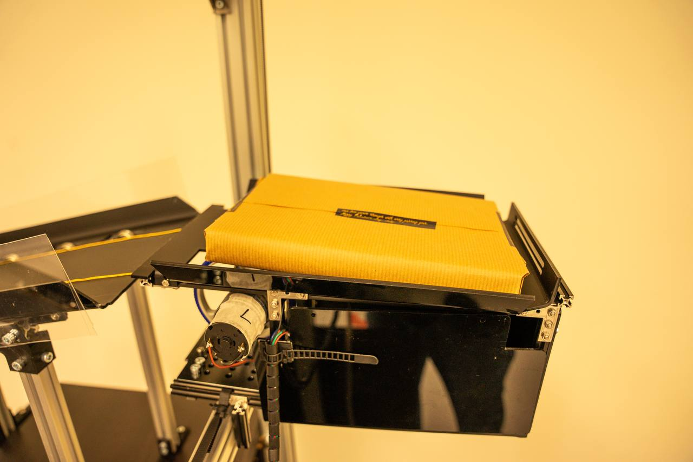

# Hub

## Introduction
The hub is in charge of collecting and dispensing parcels to and from a robot. The interface to collect and dispense the parcels are using the same mechanisms. The `hub_python` package is a wrapper package around other ROS2 Actions and Services running on the `cnc_interface` and `toolhead_action` packages.


Robots that require to collect and deposit  parcels to and from the hub can simply call the necessary ROS2 actions and services of the `hub_python` instead of mannually interfacing with the  `cnc_interface` and `toolhead_action` packages.
<br></br>

## The Hub
|||
|-|-|
|||
|Robot interfacing with hub|Completed image of delivery hub|

## Hardware


#### Toolhead

The hub toolhead is attached to the x axis arm of the hub. The to the toolhead has wheels mounted to motors that spin inwards and outwards to collect and receive parcels. At the bottom of the toolhead there is servo activated actuator that pushes the storage components when collect parcels from the pigeon holes.
<br></br>

#### Parcel Interface
There are two parcel interfaces in the hub. The interfaces are basically two slides that allows parcels to slide down into the robot during collection and vice versa when the robot is depositing parcels to the hub

<br></br>

#### Parcel Storage mechanism
The parcel storage mechnisms is a unique passive mechanism. The parcel storage mechanism tilts downwards at rest and allows the parcels to slide in during deposition. During collection, the toolhead actuator pushes the bottom of the storage mechanism that tilts the storage mechanism in the opposite direction allowing for the parcel to slide down into the toolhead as shown below.

|||
|-|-|
|||
|Collect| Deposit|
<br></br>

## Electronics
The main electronical components of the hub:
* Raspberry Pi 4B
* MKS Base V1.5
* Arduino Nano
* MG996 Servo
* 12V DC Motor


<br></br>

### RPI
The Raspberry Pi is the main 'brain' of the hub. It is the device which all the ROS2 actions servers and services are run on. The Makerbase and the Arduino Nano are connected to the Raspberry Pi via USB Ports. The devices are using Serial communication.


### MKS Base V1.5
The microcontroller controlling the stepper motors is a makerbase. The makerbase was recycled from an old 3D printer.

### Arduino Nano
The Arduino Nano controls the MG996 Servo.
<br></br>

## Running the hub packages

To run `hub_node` together with all the necessary nodes for the hub to function:
```
cd <workspace path>
source .install/setup.bash
ros2 launch hub_python
```

Alternatively, you can run each of the nodes individually
```
cd <workspace path>
source .install/setup.bash
ros2 launch toolhead_action toolhead_action_server.launch.py
ros2 launch cnc_interface cnc_interface.launch.py
ros2 run hub_python hub_node
```
<br></br>

## View the model on Rviz
```
ros2 launch display.launch.py
```
<br></br>

## Credits and references
* `cnc_interface` source: from https://github.com/picatostas/
    * Our `cnc_interface` package was adapted from [Picatostas's](https://github.com/picatostas) `cnc_interface` package.
    * Our version runs on ROS2 and also has and ROS2 action server implemented which allows other packages to send action goals to the server.


